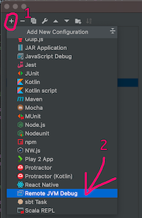
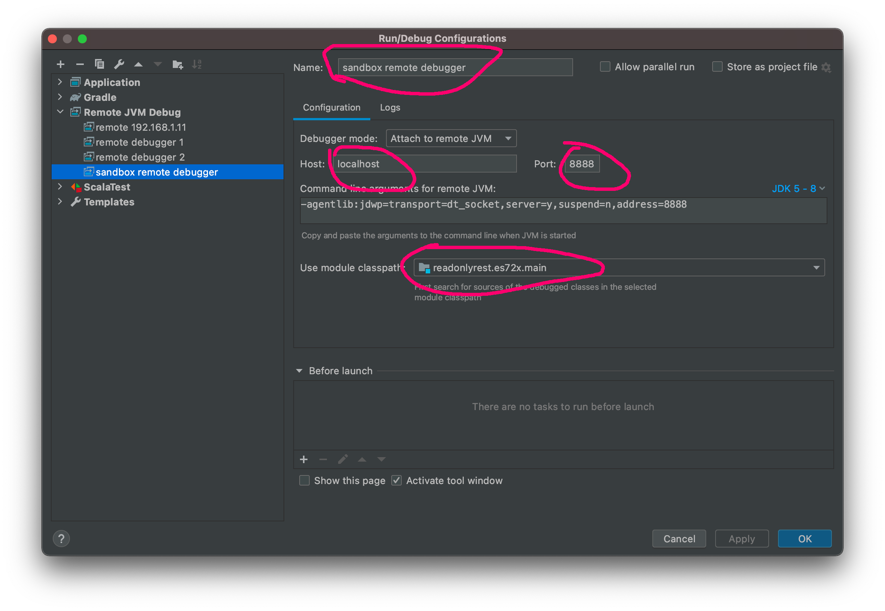
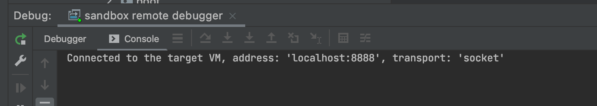

## ReadonlyREST sandbox

The purpose of this sandbox is to make it easy to set up the Elasticsearch and optionally the Kibana, along with the ROR plugin. It's called sandbox because it creates an isolated environment that is completely independent of what you have installed on your system. Additionally, it doesn't change any settings or data on a system it's run on, besides created Docker volumes(which can be easily cleaned using clean_all.sh script). Because of all these features, it's well suited for tests, experiments with configuration, development and so on.

Here's a list of things that you can do with this sandbox:
* Set up a specific version of Elasticsearch and Kibana with the ROR plugin.
* Set up Elasticsearch and Kibana along with ROR plugin from a custom location.
* Set up Elasticsearch for remote debugging.
* Set up Kibana connected to Elasticsearch executed in IDE for Elasticsearch plugin debugging.

### Requirements

To use this sandbox you will need two things installed on your system: Docker and Docker Compose. Here are links to pages with instructions on how to install them:
* https://docs.docker.com/get-docker/
* https://docs.docker.com/compose/install/

### Quick start

Sandbox comes pre-configured with some default settings, which enable you to start it out of the box. Here's how you can do it:
1. Make sure that you have Docker and Docker Compose installed on your system.
1. Open terminal.
1. Go to the root directory of the sandbox using `cd`.
1. Execute `./run_elasticsearch_and_kibana.sh`. After a few seconds, or when you see the log message `Status changed from red to green - Ready` Elasticsearch and Kibana should be ready to use.
1. Go to http://localhost:5601 URL to open Kibana's web UI. Default admin credentials are:
```
        Username: admin
        Password: passwd
```
1. To stop the sandbox, press the `Ctrl+C` keys combination in the terminal where the sandbox was executed.
1. By default, the state of Elasticsearch and Kibana is preserved for the next run. If you want to clean it, execute `./clean_all.sh`.

## Configuration
For most purposes, it should be enough to change only files under the `conf` directory to adapt the sandbox to specific needs. Base sandbox settings such as Elasticsearch and Kibana version or plugins location can be changed in `env_configuration` file. This directory also contains configuration files mounted directly to Elasticsearch and Kibana services run in containers. If you want to change any service configuration file which isn't present under the `conf` directory, you have to add it's mounting manually to `dc-internals/docker-compose.yml`. Description of Docker volumes and how to handle mounts can be found [here](https://docs.docker.com/compose/compose-file/compose-file-v3/#short-syntax-3).

Here's description of each file under the `conf` directory:
* `conf/`
  * `env_configuration` - file which is used to configure version of Elasticsearch and Kibana, location of ROR plugins, etc.
  * `elasticsearch/`
    * `elasticsearch.yml` - minimal single node Elasticsearch configuration file.
    * `jvm.options` - default file with added remote debugging on port 8888.
    * `log4j2.properties` - log4j properties file which could be used to change log level for Elasticsearch.
    * `readonlyrest.yml` - sample ROR configuration file which allows Kibana to access it.
  * `kibana/`
    * `kibana.yml` - minimal Kibana configuration file with debug logs enabled
  * `kibana-oss/`
    * `kibana.yml` - minimal Kibana configuration file with debug logs enabled

### env_configuration file 
This file contains environment variables used to configure the sandbox. Here's description of each variable:
* `ELASTICSEARCH_VERSION` - version of Elasticsearch server to use. 
* `KIBANA_VERSION` - version of Kibana server to use.
* `USING_DOCKER_FOR_MAC_OR_WINDOWS` - variable controlling address of host machine in Docker containers. It's different for Linux and Mac/Windows. Set it to `y` when you are using macOS or Windows and `n` in other cases.
* `CUSTOM_ROR_ELASTICSEARCH_LOCATION` - specifies custom URL for Elasticsearch ROR plugin. For example, could be used to run elastic with file from S3. When empty, the latest ROR will be downloaded from `https://api.beshu.tech/download/es?esVersion=$ELASTICSEARCH_VERSION`
* `CUSTOM_ROR_KIBANA_LOCATION` - specifies custom URL for Kibana ROR plugin. For example, could be used to run Kibana with a file from S3. When empty, the latest ROR will be downloaded from `https://api.beshu.tech/download/trial?esVersion=$ELASTICSEARCH_VERSION`

### Architecture
The whole sandbox is based on Docker and uses Docker Compose to orchestrate containers. There are 3 services configured in `dc-internals/docker-compose.yml`:
* elasticsearch - could be used as a standalone Elasticsearch instance with the ability to connect a remote debugger to it.
* kibana - configured to connect to Elasticsearch instance from this sandbox.
* kibana-oss - oss version of Kibana designated to work with Elasticsearch run from `eshome` located in `elasticsearch-readonlyrest-plugin` repository. 

> :warning: Each service has been intended to run from dedicated script which configures environment variables used in docker-compose.yml, builds proper image and runs it. If you want to use docker-compose directly check section "Using docker-compose manually" 

#### Exposed ports
By default services from sandbox expose these ports:
* `9200` - Elasticsearch REST
* `8888` - Elasticsearch remote debug 
* `5601` - Kibana


## Starting services

> :warning: Each service has been intended to run from dedicated script which configures environment variables used in docker-compose.yml, builds proper image and runs it. If you want to use docker-compose directly check section "Using docker-compose manually" 

There are few dedicated scripts to run services, prepare env for custom use and clean env from data. Scripts that are used to run services start in terminal attached mode. It's done this way to make it less likely that you will forget to reload service after config change or service would be left running in the background. To stop service press `Ctrl+C`.

Each script was intended to be executed from the root sandbox directory. Using it from other directories will mess up hardcoded paths. Here's a list of all scripts:

* `run_elasticsearch.sh` - will build and run Elasticsearch service.
* `run_kibana.sh` - will build and run the Kibana service. You can use the optional `--eshome` or `-e` parameter to run Kibana OSS dedicated to work with `eshome` ES instance located in `elasticsearch-readonlyrest-plugin` repository. 
* `run_elasticsearch_and_kibana.sh` - will build and run both Elasticsearch and Kibana. Using `Ctrl+C` on this script will stop both services, so if you want to have possibility to restart just one service use the above scripts starting a single service.
* `prepare_dc_for_custom_use.sh` - will prepare sandbox to use docker-compose manually. Remember to use it with `source ./prepare_dc_for_custom_use.sh`
* `clean.sh` - will bring down and remove all containers. Elasticsearch data will be removed by this command.
* `clean_all.sh` - will do exactly what command above, additionally removing volumes with Kibana cache.

### Using docker-compose manually
If you want to have more control over how services are executed you can use the script which will configure all env variables required by docker-compose, so it will be possible to execute docker-compose directly without using dedicated scripts. It's less convenient than using scripts because you have to remember to execute preparing script after each change to `env_configuration` file, so you may run an app with old settings.

Here's how to use it:
1. Go to sandbox directory using `cd`
1. Execute `source ./prepare_dc_for_custom_use.sh`
1. You are now should be able to execute for example `docker-compose up -d elasticsearch`
1. After each change to `env_configuration` repeat step 2.

## Use cases
All examples here assume that you are in sandbox root directory
### Starting both Kibana and Elasticsearch X.Y.Z with latest ROR plugin
1. Open `conf/env_configuration` and change value of `ELASTICSEARCH_VERSION` and `KIBANA_VERSION` to X.Y.Z
1. Execute `./run_elasticsearch_and_kibana.sh` or if you want to individually restart Kibana or Elasticsearch execute `./run_elasticsearch.sh` in on tab of terminal and `./run_kibana.sh` in another.
1. Optionally connect remote debugger to Elasticsearch to `localhost:8888`
1. Use `Ctrl+C` to stop services when you're done or want to restart them.

### Starting both kibana and Elasticsearch X.Y.Z with non-latest ROR plugin
1. Open `conf/env_configuration` and: 
  1. change value of `ELASTICSEARCH_VERSION` and `KIBANA_VERSION` to X.Y.Z
  1. change value of `CUSTOM_ROR_ELASTICSEARCH_LOCATION` to URL or file containing ROR Elasticsearch plugin.
  1. change value of `CUSTOM_ROR_KIBANA_LOCATION` to URL or file containing ROR Kibana plugin.
1. Execute `./run_elasticsearch_and_kibana.sh` or if you want to eventually restart Kibana or Elasticsearch execute `./run_elasticsearch.sh` in on tab of terminal and `./run_kibana.sh` in another.
1. Optionally connect remote debugger to elasticsearch to `localhost:8888`
1. Use `Ctrl+C` to stop services when you're done or want to restart them.

### Starting Kibana X.Y.Z for use with Elasticsearch started from `eshome` located in `elasticsearch-readonlyrest-plugin` repository.
1. Make sure that `eshome/config/readonlyrest.yml` file contains such rule: 
```
- name: KIBANA_SERVER
  auth_key: kibana:kibana
  verbosity: error
```
1. Start Elasticsearch in IDE. Kibana assumes that it will be able to connect to it on port 9200.
1. Open `conf/env_configuration` and change value of `KIBANA_VERSION` to X.Y.Z
1. Execute `./run_kibana.sh -e`
1. Use `Ctrl+C` to stop kibana when you're done or want to restart it.

## Connecting IntelliJ IDEA remote debugger to Elasticsearch set up in sandbox 
Here's description of how to connect remote debugger to running Elasticsearch server which has been started using this sandbox.
1. Open the `elasticsearch-readonlyrest-plugin` project in IntelliJ IDEA.
1. Checkout commit with the same version of ROR code that is running in Elasticsearch you want to connect.
1. Open `Edit configurations...` window. It can be done by pressing shift key twice and entering "Edit configurations" or from `Run->Edit configurations...` menu.
1. If you don't have remote debugger configuration yet add it by clicking "+" icon and choosing `Remote JVM Debug`

1. New configuration will be automatically selected. You can assign it a custom name like "sandbox remote debugger" on presented screenshot. Host and port should be set exactly as they are on this screenshot. Last marked thing is module classpath. You should choose module corresponding to ES version you are trying to debug with name ending with `.main`. Module selected on screenshot is appropriate for debugging ES 7.2.x. 
1. Click OK to save configuration. 
1. You should now see name of created configuration in upper right corner of IntelliJ IDEA. 
1. Click on a bug icon next to it to start debugger.
1. After successful connection, window like that should pop up from the bottom
